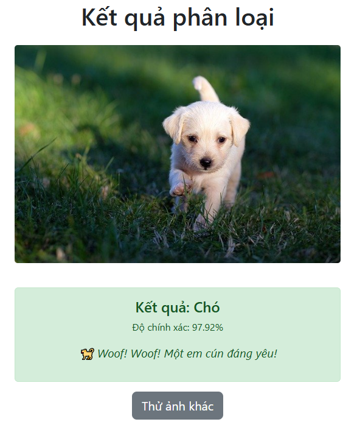
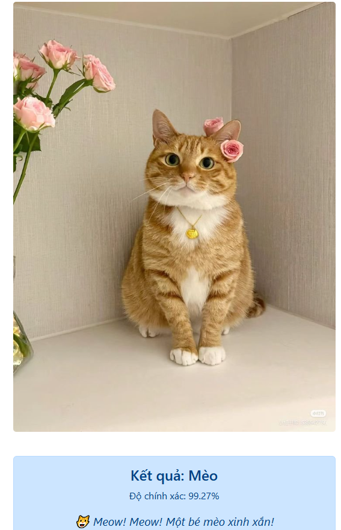
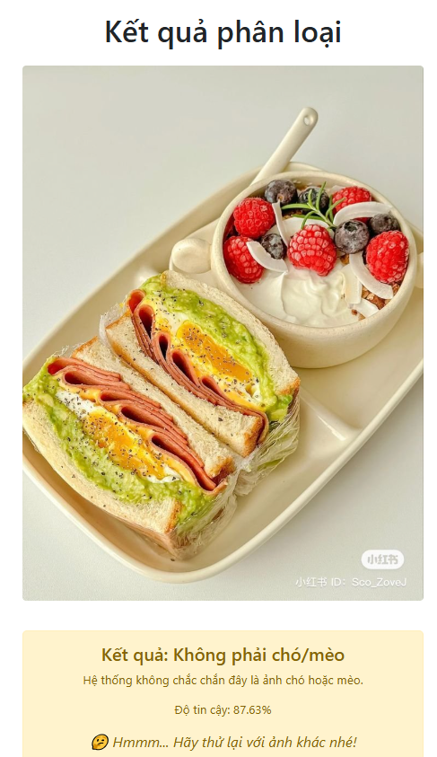

# DOG AND CAT CLASSIFICATION USING CNN

This repository provides a simple implementation of a **Convolutional Neural Network (CNN)** for binary classification of dogs and cats. It is designed for **first- and second-year students** who are interested in exploring CNNs and binary classification problems. The code and dataset are based on the [Dog and Cat Classification Dataset](https://www.kaggle.com/datasets/bhavikjikadara/dog-and-cat-classification-dataset/data) from Kaggle. A big thank you to **BHAVIKJIKADARA** for providing this dataset!

## Overview
The project includes a CNN model built using Keras to classify images as either a dog or a cat. The repository also includes an *Out-of-Distribution (OOD)* detection mechanism using Monte Carlo Dropout (MCD), but it is **not fully optimized** yet. Therefore, users should only test the model with images of dogs or cats. Images of other objects (e.g., humans, food) may be misclassified, as shown in the example results below.

### Model Details
- **model_2504.pkl**: Trained for 20 epochs.
- **model_250425.pkl**: Trained for 30 epochs.
- Both models were trained on a machine with a **Ryzen 7 5700U** chip.

## Results
Here are some example results from the model:

- **Dog Classification**  
    
  The model correctly identifies this as a dog with *97.92%* confidence.

- **Cat Classification**  
    
  The model correctly identifies this as a cat with *99.27%* confidence.

- **Out-of-Distribution (OOD) Misclassification**  
    
  This image of food is misclassified as "Không phải chó/mèo" (Not a dog/cat) with *87.93%* confidence. The OOD detection is still a work in progress.

## Recommendations
- This project is ideal for beginners (first- and second-year students) learning about CNNs and binary classification.
- For best results, test the model with images of dogs or cats only.
- Avoid using images of other objects, as the OOD detection is not fully reliable yet.
## Usage
- Install dependencies:
  	pip install tensorflow flask pandas numpy matplotlib pillow scipy
- Run the Flask app to test the model:
  	python app.py
- Open your browser and go to http://127.0.0.1:5000/ to upload an image and see the classification result.
  
Vietnamese below
# PHÂN LOẠI CHÓ VÀ MÈO SỬ DỤNG CNN
Cung cấp một triển khai đơn giản của Mạng Nơ-ron Tích chập (CNN) để phân loại nhị phân chó và mèo. Nếu bạn là sinh viên năm 1,2 muốn tìm hiểu về CNN và bài toán phân loại nhị phân hi vọng repo này hữu ích đối với bạn. Repo dựa trên [Dog and Cat Classification Dataset](https://www.kaggle.com/datasets/bhavikjikadara/dog-and-cat-classification-dataset/data) từ Kaggle. Xin cảm ơn BHAVIKJIKADARA đã cung cấp tập dữ liệu này!
## Tổng quan
Dự án bao gồm một mô hình CNN được xây dựng bằng Keras để phân loại ảnh là chó hoặc mèo và cũng bao gồm cơ chế phát hiện dữ liệu ngoài phân phối (Out-of-Distribution - OOD) sử dụng Monte Carlo Dropout (MCD), nhưng cơ chế này chưa được tối ưu hoàn toàn. Vì vậy, người dùng chỉ nên thử nghiệm với ảnh của chó hoặc mèo. Ảnh của các đối tượng khác (ví dụ: con người, đồ ăn) có thể bị phân loại sai
### Chi tiết mô hình
- model_2504.pkl: Được huấn luyện trong 20 epoch.
- model_250425.pkl: Được huấn luyện trong 30 epoch.
- Cả hai mô hình đều được huấn luyện trên máy có chip Ryzen 7 5700U.
## Khuyến nghị
- Dự án này phù hợp cho người mới bắt đầu (sinh viên năm nhất và năm hai) tìm hiểu về CNN và phân loại nhị phân.
- Để có kết quả tốt nhất, hãy thử nghiệm mô hình với ảnh của chó hoặc mèo.
- Tránh sử dụng ảnh của các đối tượng khác, vì cơ chế phát hiện OOD chưa thực sự đáng tin cậy.
